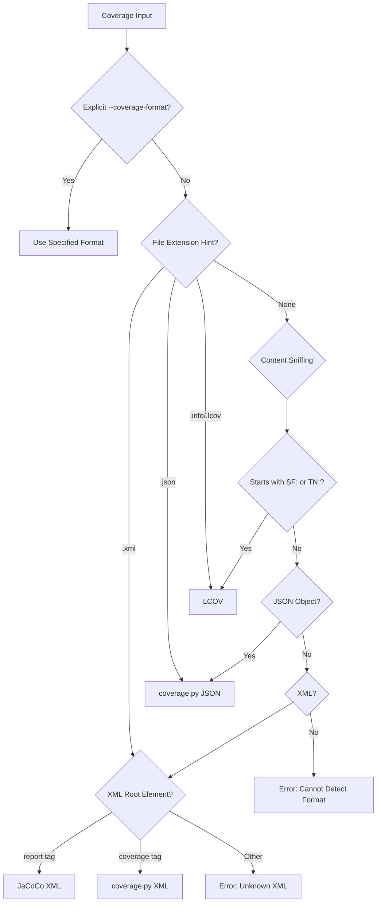
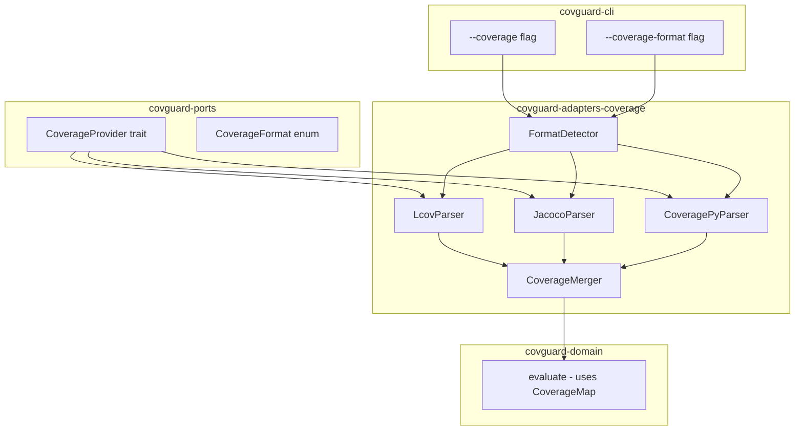

# ADR-019: Alternative Coverage Format Adapters (JaCoCo, coverage.py)

## Status

Proposed

## Context

covguard currently supports only LCOV coverage format. Users working with Java (JaCoCo XML) or Python (coverage.py JSON/XML) projects must convert their coverage data to LCOV format before using covguard, creating friction in adoption.

### Current Architecture

The existing coverage handling consists of:

1. **Port Trait** ([`CoverageProvider`](../../crates/covguard-ports/src/lib.rs:37)) - defines the interface with LCOV-specific naming:
   ```rust
   pub trait CoverageProvider {
       fn parse_lcov(&self, text: &str, strip_prefixes: &[String]) -> Result<CoverageMap, String>;
       fn merge_coverage(&self, maps: Vec<CoverageMap>) -> CoverageMap;
   }
   ```

2. **Adapter** ([`LcovCoverageProvider`](../../crates/covguard-adapters-coverage/src/lib.rs:39)) - implements the trait with LCOV parsing logic

3. **Domain** ([`evaluate()`](../../crates/covguard-domain/src/lib.rs:116)) - consumes `CoverageMap` directly, format-agnostic

4. **CLI** ([`main.rs`](../../crates/covguard-cli/src/main.rs:106)) - uses `--lcov` flag with no format specification option

### Problem Statement

- The trait method `parse_lcov()` is named for a specific format
- No mechanism exists for format detection or specification
- Adding new formats requires architectural decisions about:
  - Trait design evolution
  - Format detection strategy
  - Crate organization
  - CLI integration

### Format Characteristics

| Format | Language | File Type | Line Coverage | Branch Coverage | Path Handling |
|--------|----------|-----------|---------------|-----------------|---------------|
| LCOV | C/C++/JS | Text | DA records | BRDA records | SF: paths |
| JaCoCo | Java | XML | line counters | branch counters | package/class |
| coverage.py | Python | JSON/XML | line numbers | branch coverage | relative paths |

## Decision

We will implement a **pluggable coverage format architecture** with format auto-detection and explicit override capability.

### 1. Trait Evolution: Format-Agnostic Interface

Rename and extend the `CoverageProvider` trait to be format-agnostic:

```rust
/// Supported coverage formats
#[derive(Debug, Clone, Copy, PartialEq, Eq, Default)]
pub enum CoverageFormat {
    #[default]
    Lcov,
    Jacoco,
    CoveragePy,
}

/// Coverage provider port with format awareness
pub trait CoverageProvider {
    /// Parse coverage data in the specified format
    fn parse_coverage(
        &self,
        text: &str,
        format: CoverageFormat,
        strip_prefixes: &[String],
    ) -> Result<CoverageMap, String>;

    /// Auto-detect format and parse
    fn parse_coverage_auto(
        &self,
        text: &str,
        strip_prefixes: &[String],
    ) -> Result<(CoverageMap, CoverageFormat), String>;

    /// Merge multiple coverage maps
    fn merge_coverage(&self, maps: Vec<CoverageMap>) -> CoverageMap;
    
    /// Detect format from content and optional file extension
    fn detect_format(&self, text: &str, file_hint: Option<&str>) -> Result<CoverageFormat, String>;
}
```

**Backward Compatibility**: Keep `parse_lcov()` as a deprecated wrapper:

```rust
#[deprecated(since = "0.4.0", note = "Use parse_coverage with CoverageFormat::Lcov")]
fn parse_lcov(&self, text: &str, strip_prefixes: &[String]) -> Result<CoverageMap, String> {
    self.parse_coverage(text, CoverageFormat::Lcov, strip_prefixes)
}
```

### 2. Format Detection Strategy

Implement a tiered detection approach:



**Detection Priority**:
1. Explicit `--coverage-format` CLI flag (highest)
2. File extension hint from input path
3. Content sniffing (lowest confidence)

**Content Sniffing Rules**:

| Format | Primary Indicator | Secondary Indicators |
|--------|-------------------|---------------------|
| LCOV | Lines starting with `SF:` or `TN:` | `DA:`, `end_of_record` |
| JaCoCo XML | `<report>` root element with `counter` children | `sessioninfo`, `package`, `sourcefile` |
| coverage.py JSON | JSON object with `files` key | `meta.format`, `lines` dict |
| coverage.py XML | `<coverage>` root element | `packages`, `package`, `class` |

### 3. Crate Organization

**Option Selected: Single Crate with Feature Flags**

Keep all coverage adapters in `covguard-adapters-coverage` with optional format support via Cargo features:

```toml
# crates/covguard-adapters-coverage/Cargo.toml
[features]
default = ["lcov"]
lcov = []
jacoco = ["quick-xml"]
coverage-py = ["serde_json", "serde"]

[dependencies]
covguard-ports = { path = "../covguard-ports" }
covguard-paths = { path = "../covguard-paths" }
thiserror = "2.0"

# Optional dependencies
quick-xml = { version = "0.37", optional = true }
serde = { version = "1.0", optional = true }
serde_json = { version = "1.0", optional = true }
```

**Rationale**:
- Simpler dependency management for most users
- Default feature provides LCOV-only for minimal footprint
- Feature flags allow excluding unused parsers
- Single crate reduces maintenance overhead

**Alternative Considered: Separate Crates**

```
covguard-adapters-coverage-lcov
covguard-adapters-coverage-jacoco
covguard-adapters-coverage-py
covguard-adapters-coverage-core  # shared types and traits
```

Rejected because:
- More crates to maintain
- Complex dependency graph
- Users typically need only one format

### 4. Architecture Diagram



### 5. Normalization Layer

Each parser normalizes format-specific data to the canonical `CoverageMap`:

```rust
pub type CoverageMap = BTreeMap<String, BTreeMap<u32, u32>>;
//                       ^file path      ^line    ^hit count
```

**JaCoCo Normalization**:

```xml
<!-- Input: JaCoCo XML -->
<report>
  <package name="com/example">
    <sourcefile name="MyClass.java">
      <line nr="10" ci="3" cb="0" mb="0"/>
      <line nr="15" ci="0" cb="2" mb="1"/>
    </sourcefile>
  </package>
</report>
```

Maps to:
- Path: `com/example/MyClass.java` (convert package to path)
- Line 10: hits = 3 (ci = instruction coverage)
- Line 15: hits = 0 (ci = 0, partially covered branch)

**coverage.py JSON Normalization**:

```json
{
  "files": {
    "src/my_module.py": {
      "executed_lines": [1, 2, 5, 10],
      "summary": {"num_statements": 10}
    }
  }
}
```

Maps to:
- Path: `src/my_module.py`
- Lines 1, 2, 5, 10: hits = 1
- Other lines within range: not in map (missing coverage data)

### 6. CLI Integration

Add new CLI flags while maintaining backward compatibility:

```rust
/// Path to coverage file - replaces --lcov, supports all formats
#[arg(long)]
coverage: Vec<String>,

/// Explicit coverage format - auto-detected if not specified
#[arg(long, value_enum)]
coverage_format: Option<CoverageFormatCli>,

/// Legacy: Path to LCOV coverage file - use --coverage instead
#[arg(long)]
lcov: Vec<String>,
```

**CLI Examples**:

```bash
# Auto-detection (recommended)
covguard check --diff-file diff.patch --coverage coverage.xml

# Explicit format
covguard check --diff-file diff.patch --coverage jacoco.xml --coverage-format jacoco

# Multiple coverage files with mixed formats
covguard check --base main --head feature \
  --coverage lcov.info \
  --coverage jacoco.xml

# Legacy (still works, deprecated)
covguard check --diff-file diff.patch --lcov coverage.info
```

### 7. Error Handling

Define format-specific errors with actionable messages:

```rust
#[derive(Debug, Error)]
pub enum CoverageError {
    #[error("Invalid LCOV format: {0}")]
    LcovInvalid(String),
    
    #[error("Invalid JaCoCo XML: {0}")]
    JacocoInvalid(String),
    
    #[error("Invalid coverage.py format: {0}")]
    CoveragePyInvalid(String),
    
    #[error("Cannot detect coverage format. Use --coverage-format to specify.")]
    FormatDetectionFailed,
    
    #[error("Coverage format {0:?} is not supported. Build with feature flag: {1}")]
    FormatNotEnabled(CoverageFormat, &'static str),
}
```

Error messages include:
- Format-specific validation errors
- Line numbers where parsing failed
- Suggestion to use explicit format flag

### 8. Performance Considerations

| Format | Parser | Typical File Size | Memory Impact |
|--------|--------|-------------------|---------------|
| LCOV | Line-by-line | 1-50 MB | Low (streaming) |
| JaCoCo XML | DOM (quick-xml) | 100 KB - 10 MB | Medium (tree building) |
| coverage.py JSON | serde_json | 100 KB - 5 MB | Medium (deserialization) |

**Mitigations**:
- JaCoCo: Use quick-xml's streaming reader for large files (>10 MB)
- coverage.py: JSON is typically smaller than XML equivalent
- All formats: Parse only once, reuse `CoverageMap`

## Implementation Notes

### JaCoCo Parser Implementation

```rust
pub fn parse_jacoco(text: &str, strip_prefixes: &[String]) -> Result<CoverageMap, CoverageError> {
    use quick_xml::Reader;
    
    let mut coverage_map: CoverageMap = BTreeMap::new();
    let reader = Reader::from_str(text);
    
    // State machine for parsing
    let mut current_package: Option<String> = None;
    let mut current_file: Option<String> = None;
    
    // ... parse <package>, <sourcefile>, <line> elements
    
    Ok(coverage_map)
}
```

Key considerations:
- `package/@name` uses `/` separators in JaCoCo
- `sourcefile/@name` is just the filename
- Combine to form full path: `{package}/{sourcefile}`
- `line/@ci` (instruction covered) maps to hit count

### coverage.py Parser Implementation

```rust
pub fn parse_coverage_py_json(text: &str, strip_prefixes: &[String]) -> Result<CoverageMap, CoverageError> {
    #[derive(serde::Deserialize)]
    struct CoveragePyData {
        files: BTreeMap<String, FileCoverage>,
    }
    
    #[derive(serde::Deserialize)]
    struct FileCoverage {
        executed_lines: Vec<u32>,
    }
    
    let data: CoveragePyData = serde_json::from_str(text)
        .map_err(|e| CoverageError::CoveragePyInvalid(e.to_string()))?;
    
    let mut coverage_map: CoverageMap = BTreeMap::new();
    
    for (path, file_cov) in data.files {
        let normalized = normalize_path_with_strip(&path, strip_prefixes);
        let lines: BTreeMap<u32, u32> = file_cov
            .executed_lines
            .into_iter()
            .map(|line| (line, 1))
            .collect();
        coverage_map.insert(normalized, lines);
    }
    
    Ok(coverage_map)
}
```

Key considerations:
- `executed_lines` contains line numbers with coverage
- Lines not in `executed_lines` are either uncovered or non-executable
- coverage.py 5.0+ uses JSON format by default
- XML format also supported for older versions

## Consequences

### Positive

- **Broader Language Support**: Java and Python projects can use covguard directly
- **Reduced Friction**: No need to convert coverage formats
- **Backward Compatible**: Existing `--lcov` flag continues to work
- **Extensible**: Adding new formats follows the same pattern
- **Smart Defaults**: Auto-detection works for most cases

### Negative

- **Increased Dependencies**: XML and JSON parsers add to binary size
- **Complexity**: More code paths to test and maintain
- **Ambiguous Detection**: Some edge cases may require explicit format flag
- **Feature Flag Complexity**: Users must enable features for non-LCOV formats

### Neutral

- **Trait Renaming**: `parse_lcov()` deprecated but not removed
- **CLI Flag Addition**: `--coverage` preferred over `--lcov`, both work

## Migration Path

### Phase 1: Foundation
1. Add `CoverageFormat` enum to `covguard-ports`
2. Extend `CoverageProvider` trait with new methods
3. Implement format detection in `covguard-adapters-coverage`

### Phase 2: JaCoCo Support
1. Add `quick-xml` dependency with `jacoco` feature
2. Implement `parse_jacoco()` function
3. Add JaCoCo test fixtures

### Phase 3: coverage.py Support
1. Add `serde` and `serde_json` dependencies with `coverage-py` feature
2. Implement `parse_coverage_py_json()` function
3. Add coverage.py test fixtures

### Phase 4: CLI Integration
1. Add `--coverage` and `--coverage-format` flags
2. Update documentation
3. Deprecate `--lcov` in release notes

## References

- [JaCoCo XML Format Documentation](https://www.jacoco.org/jacoco/trunk/doc/jacoco.xml)
- [coverage.py JSON Format](https://coverage.readthedocs.io/en/latest/cmd.html#json-reporting-coverage-json)
- [LCOV Format Description](https://manpages.debian.org/unstable/lcov/geninfo.1.en.html)
- [ADR-000: Architecture Decision Record Template](ADR-000.md)
- [Architecture Documentation](../architecture.md)
