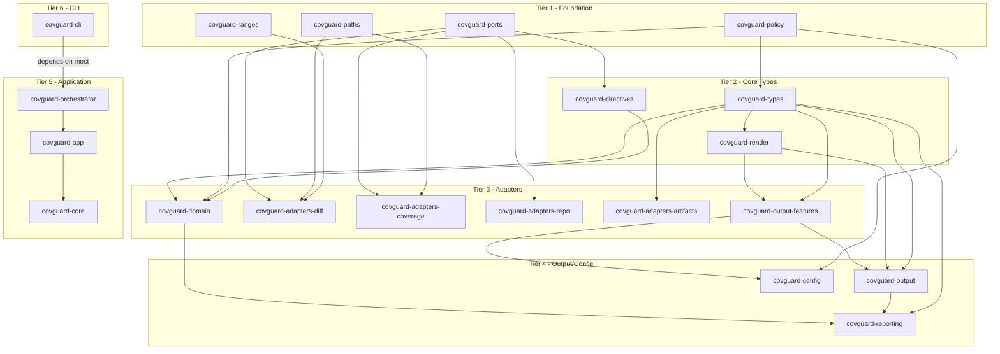

# Cargo.toml Crates.io Readiness Audit

**Audit Date:** 2026-03-11
**Workspace:** covguard
**Total Crates:** 20

## Executive Summary

The covguard workspace is **mostly ready** for crates.io publishing. All crates have the required metadata (name, version, description, license, edition). However, 4 crates are missing optional but recommended metadata fields, and there are potential concerns with the `rust-version` and `edition` values.

### Critical Issues

| Issue | Severity | Details |
|-------|----------|---------|
| `rust-version = "1.92"` | Good | Rust 1.92 is current and real. |
| `edition = "2024"` | Good | Rust 2024 is current and real. |
| Missing `authors` | ℹ️ Low | No crate has an `authors` field (recommended but not required) |

## Metadata Status Matrix

| Crate | name | version | description | license | repository | homepage | documentation | readme | keywords | categories | rust-version | authors |
|-------|:----:|:-------:|:-----------:|:-------:|:----------:|:--------:|:-------------:|:------:|:--------:|:----------:|:------------:|:-------:|
| covguard-adapters-artifacts | ✅ | ✅ | ✅ | ✅ | ✅ | ✅ | ✅ | ✅ | ✅ | ✅ | ✅ | ❌ |
| covguard-adapters-coverage | ✅ | ✅ | ✅ | ✅ | ✅ | ✅ | ✅ | ✅ | ✅ | ✅ | ✅ | ❌ |
| covguard-adapters-diff | ✅ | ✅ | ✅ | ✅ | ✅ | ✅ | ✅ | ✅ | ✅ | ✅ | ✅ | ❌ |
| covguard-adapters-repo | ✅ | ✅ | ✅ | ✅ | ✅ | ✅ | ✅ | ✅ | ✅ | ✅ | ✅ | ❌ |
| covguard-app | ✅ | ✅ | ✅ | ✅ | ✅ | ✅ | ✅ | ✅ | ✅ | ✅ | ✅ | ❌ |
| covguard-cli | ✅ | ✅ | ✅ | ✅ | ✅ | ✅ | ✅ | ✅ | ✅ | ✅ | ✅ | ❌ |
| covguard-config | ✅ | ✅ | ✅ | ✅ | ✅ | ✅ | ✅ | ✅ | ✅ | ✅ | ✅ | ❌ |
| covguard-core | ✅ | ✅ | ✅ | ✅ | ✅ | ✅ | ✅ | ✅ | ✅ | ✅ | ✅ | ❌ |
| covguard-directives | ✅ | ✅ | ✅ | ✅ | ✅ | ✅ | ❌ | ✅ | ❌ | ✅ | ✅ | ❌ |
| covguard-domain | ✅ | ✅ | ✅ | ✅ | ✅ | ✅ | ✅ | ✅ | ✅ | ✅ | ✅ | ❌ |
| covguard-orchestrator | ✅ | ✅ | ✅ | ✅ | ✅ | ✅ | ✅ | ✅ | ✅ | ✅ | ✅ | ❌ |
| covguard-output | ✅ | ✅ | ✅ | ✅ | ✅ | ✅ | ❌ | ✅ | ❌ | ❌ | ✅ | ❌ |
| covguard-output-features | ✅ | ✅ | ✅ | ✅ | ✅ | ✅ | ✅ | ✅ | ✅ | ✅ | ✅ | ❌ |
| covguard-paths | ✅ | ✅ | ✅ | ✅ | ✅ | ✅ | ❌ | ✅ | ❌ | ❌ | ✅ | ❌ |
| covguard-policy | ✅ | ✅ | ✅ | ✅ | ✅ | ✅ | ✅ | ✅ | ✅ | ✅ | ✅ | ❌ |
| covguard-ports | ✅ | ✅ | ✅ | ✅ | ✅ | ✅ | ✅ | ✅ | ✅ | ✅ | ✅ | ❌ |
| covguard-ranges | ✅ | ✅ | ✅ | ✅ | ✅ | ✅ | ❌ | ✅ | ❌ | ❌ | ✅ | ❌ |
| covguard-render | ✅ | ✅ | ✅ | ✅ | ✅ | ✅ | ✅ | ✅ | ✅ | ✅ | ✅ | ❌ |
| covguard-reporting | ✅ | ✅ | ✅ | ✅ | ✅ | ✅ | ✅ | ✅ | ✅ | ✅ | ✅ | ❌ |
| covguard-types | ✅ | ✅ | ✅ | ✅ | ✅ | ✅ | ✅ | ✅ | ✅ | ✅ | ✅ | ❌ |

**Legend:** ✅ Present | ❌ Missing

## Crates Requiring Attention

### 1. covguard-directives

**Missing Fields:**
- `documentation` - Add: `documentation = "https://docs.rs/covguard-directives"`
- `keywords` - Add relevant keywords

**Suggested Addition:**
```toml
documentation = "https://docs.rs/covguard-directives"
keywords = ["coverage", "directives", "testing", "quality", "inline"]
```

### 2. covguard-output

**Missing Fields:**
- `documentation` - Add: `documentation = "https://docs.rs/covguard-output"`
- `keywords` - Add relevant keywords
- `categories` - Add relevant categories

**Suggested Addition:**
```toml
documentation = "https://docs.rs/covguard-output"
keywords = ["coverage", "output", "render", "testing", "reporting"]
categories = ["development-tools::testing"]
```

### 3. covguard-paths

**Missing Fields:**
- `documentation` - Add: `documentation = "https://docs.rs/covguard-paths"`
- `keywords` - Add relevant keywords
- `categories` - Add relevant categories

**Suggested Addition:**
```toml
documentation = "https://docs.rs/covguard-paths"
keywords = ["coverage", "paths", "normalization", "filesystem", "cross-platform"]
categories = ["development-tools::testing", "filesystem"]
```

### 4. covguard-ranges

**Missing Fields:**
- `documentation` - Add: `documentation = "https://docs.rs/covguard-ranges"`
- `keywords` - Add relevant keywords
- `categories` - Add relevant categories

**Suggested Addition:**
```toml
documentation = "https://docs.rs/covguard-ranges"
keywords = ["coverage", "ranges", "merge", "diff", "intervals"]
categories = ["algorithms", "development-tools::testing"]
```

## Workspace-Level Recommendations

### Update [workspace.package] in root Cargo.toml

The workspace package section should be updated with correct values:

```toml
[workspace.package]
version = "0.1.0"
edition = "2021"  # Changed from "2024" - 2024 edition is not yet stable
license = "Apache-2.0 OR MIT"
repository = "https://github.com/EffortlessMetrics/covguard"
homepage = "https://github.com/EffortlessMetrics/covguard"
readme = "README.md"
keywords = ["coverage", "diff", "testing", "ci", "code-coverage"]
categories = ["development-tools::testing", "command-line-utilities"]
rust-version = "1.75"  # Changed from "1.92" - use a realistic MSRV
```

### Add authors field (optional but recommended)

Add to `[workspace.package]`:
```toml
authors = ["Your Name <your.email@example.com>"]
```

Or add individually to each crate if authors differ.

## Publishing Order

Due to internal dependencies, crates must be published in topological order:

### Tier 1 - No internal dependencies
Publish first (in any order):
1. `covguard-paths`
2. `covguard-ranges`
3. `covguard-policy`
4. `covguard-ports`

### Tier 2 - Depend only on Tier 1
5. `covguard-types` (depends on covguard-policy)
6. `covguard-directives` (depends on covguard-ports)
7. `covguard-render` (depends on covguard-types)

### Tier 3 - Depend on Tier 1-2
8. `covguard-output-features` (depends on covguard-render, covguard-types)
9. `covguard-adapters-diff` (depends on covguard-ports, covguard-paths, covguard-ranges)
10. `covguard-adapters-coverage` (depends on covguard-ports, covguard-paths)
11. `covguard-adapters-repo` (depends on covguard-ports)
12. `covguard-adapters-artifacts` (depends on covguard-types)
13. `covguard-domain` (depends on covguard-types, covguard-policy, covguard-directives)

### Tier 4 - Depend on Tier 1-3
14. `covguard-output` (depends on covguard-output-features, covguard-render, covguard-types)
15. `covguard-reporting` (depends on covguard-domain, covguard-output, covguard-types)
16. `covguard-config` (depends on covguard-output-features, covguard-policy)

### Tier 5 - Application layer
17. `covguard-orchestrator` (depends on many crates)
18. `covguard-app` (depends on covguard-orchestrator)
19. `covguard-core` (depends on covguard-app)

### Tier 6 - CLI binary
20. `covguard` (the CLI crate, depends on most crates)

## Dependency Graph



## Pre-Publishing Checklist

- [ ] Fix `rust-version` to a valid Rust version (e.g., "1.75")
- [ ] Fix `edition` to "2021" (2024 edition is not stable)
- [ ] Add missing `documentation` field to 4 crates
- [ ] Add missing `keywords` to 4 crates
- [ ] Add missing `categories` to 3 crates
- [ ] Consider adding `authors` field
- [ ] Run `cargo publish --dry-run` on each crate in order
- [ ] Verify all README.md files exist and are meaningful
- [ ] Test installation from crates.io in a fresh project

## Commands to Publish

```bash
# After fixing metadata, publish in order:
cargo publish -p covguard-paths
cargo publish -p covguard-ranges
cargo publish -p covguard-policy
cargo publish -p covguard-ports
cargo publish -p covguard-types
cargo publish -p covguard-directives
cargo publish -p covguard-render
cargo publish -p covguard-output-features
cargo publish -p covguard-adapters-diff
cargo publish -p covguard-adapters-coverage
cargo publish -p covguard-adapters-repo
cargo publish -p covguard-adapters-artifacts
cargo publish -p covguard-domain
cargo publish -p covguard-output
cargo publish -p covguard-reporting
cargo publish -p covguard-config
cargo publish -p covguard-orchestrator
cargo publish -p covguard-app
cargo publish -p covguard-core
cargo publish -p covguard
```

## Summary

| Metric | Count |
|--------|-------|
| Total crates | 20 |
| Fully compliant | 16 |
| Missing optional fields | 4 |
| Critical issues | 2 (rust-version, edition) |
| Publishing tiers | 6 |

**Overall Status:** 🟡 Needs minor fixes before publishing
